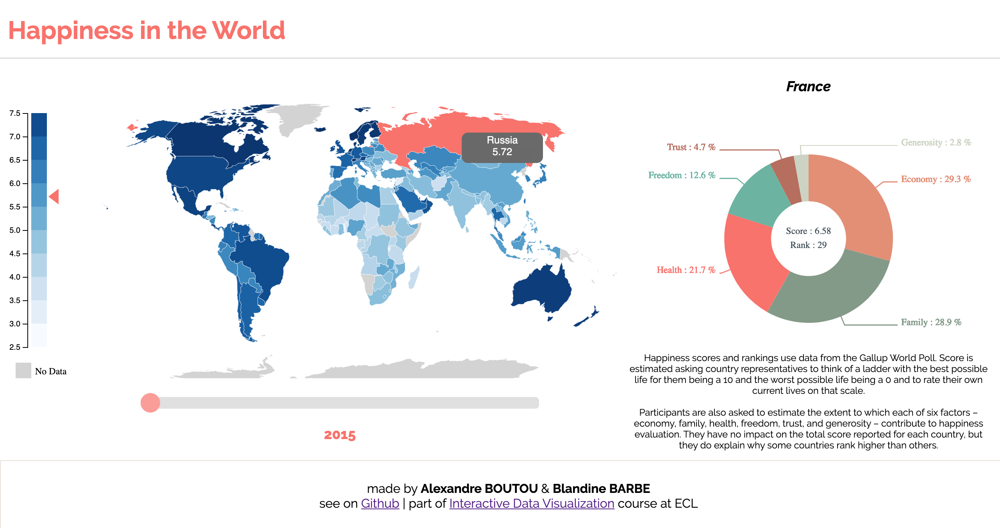

# Happiness in the World 

#### Authors of the project :
Alexandre Boutou & Blandine Barbe

#### Link to the visualization : 
https://alexboutou.github.io/world_happiness/

 

### Description
The objective is to observe the countries of the world in which the populations consider themselves the happiest; and see what are the "criteria of happiness" according to the regions of the world. We therefore want to visualize on a world map the level of happiness of the inhabitants of different countries, and the factors which, according to them, most influence their happiness.

 

### Some questions we want to answer

- What is the evolution of inhabitants' happiness of 150 diffferent countries over 5 years.
- Which are the countries where people are the happiest ?
- Are there any correlations between some factors of happiness and the regions of the world ?

 

### Data

We collected our data from a dataset available on Kaggle, just here -> https://www.kaggle.com/unsdsn/world-happiness
This is a gathering of the results of the Gallup report on happiness from 2015 to 2019.

 

### The project

- A first view of the level of happiness of 150 countries of the world

  

 

- A more precise visualization of a specific country and the factors influencing its happiness

  

 

- The global visualization with both views and a temporal slider to travel in the last 5 years.

  

 

### Online resource

#### Class of Data Visualization

https://github.com/LyonDataViz/MOS5.5-Dataviz#interactive-data-visualization-ecl-mos-55
